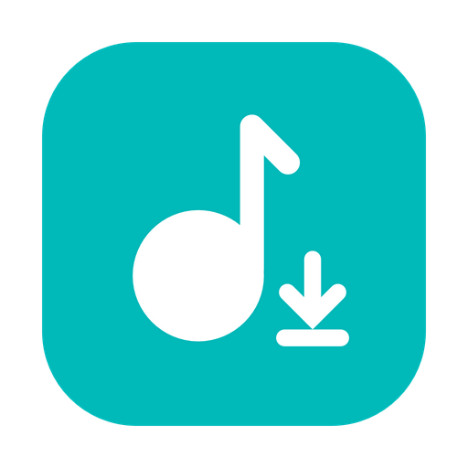
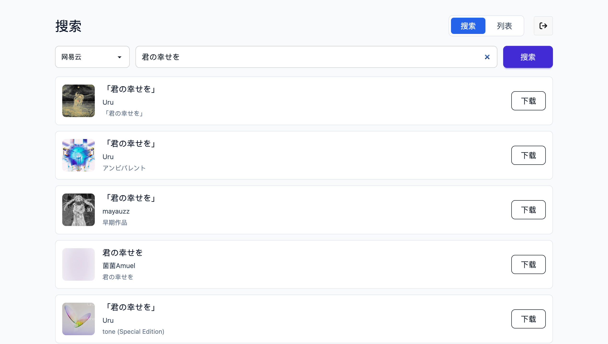
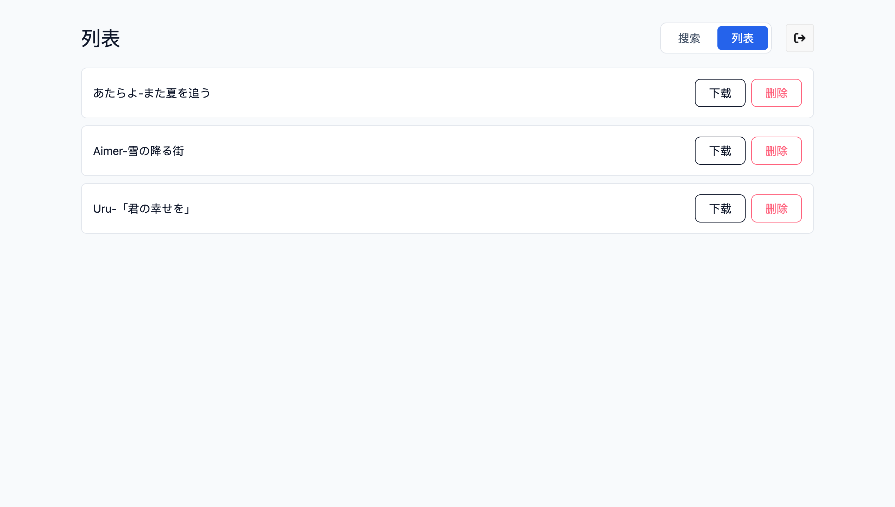

# MusicDL Web

## 简介




这是一个基于[musicdl](https://github.com/CharlesPikachu/musicdl)的网页版本，使用Docker部署，可以下载音乐至服务器  
前端页面仓库[在这里](https://github.com/Zhoucheng133/MusicDL-FrontEnd)

这个仓库是使用Docker部署的Web版本，另有基于Tauri和PyQt的桌面端版本  
[Tauri ver.](https://github.com/Zhoucheng133/MusicDL-GUI) | [PyQt ver.](https://github.com/Zhoucheng133/MusicDL-PyQt) | ★ Web ver.

>[!NOTE]
> 这个项目（尤其是前端）重度使用Vibe Coding开发

## 截图

  


## 快速开始

```bash
sudo docker run -d --restart always -p <端口号>:80 \
-v <本地数据存储位置>:/app/db \
--name musicdl \
zhouc1230/musicdl:latest
```